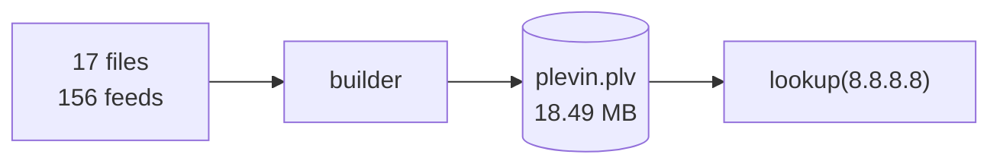
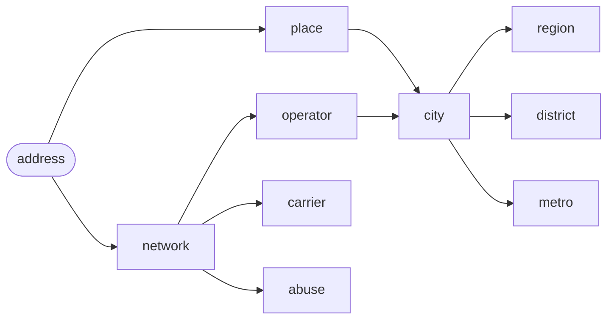
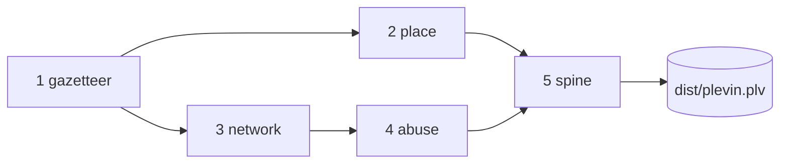
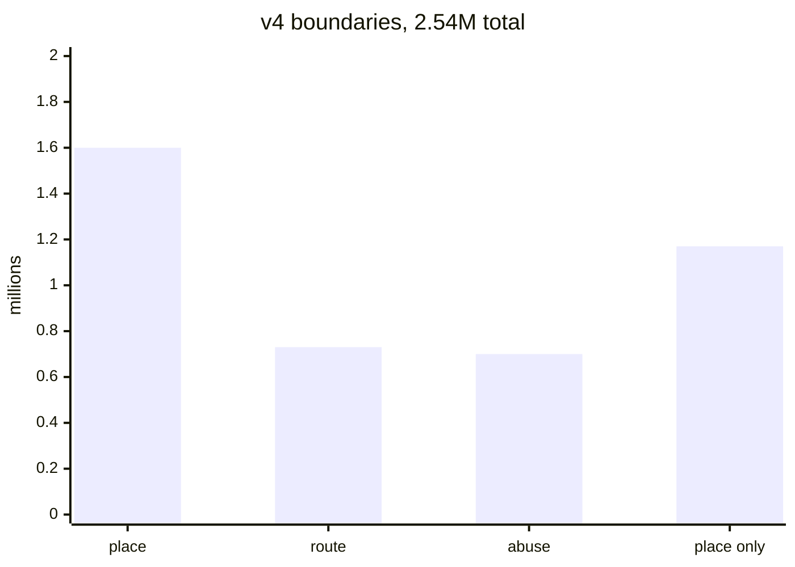
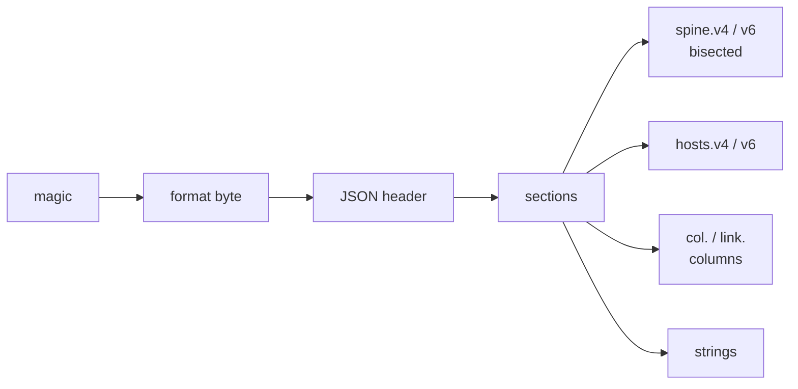
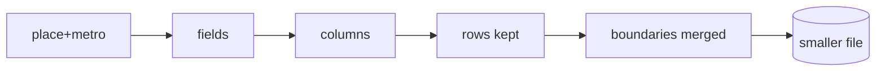

<div align="center">

# plevin builder

**Location, network and abuse information for any IP address in one offline file.**<br>
No API, no rate limit, no lookup leaving the machine.


Download the latest build:
[everything](https://github.com/tn3w/plevin/releases/latest/download/plevin.plv) 18 MB,
[location](https://github.com/tn3w/plevin/releases/latest/download/plevin.metro-place.plv) 6.9 MB,
[country](https://github.com/tn3w/plevin/releases/latest/download/plevin.place-country-code.plv) 496 KB

</div>



## Build

```bash
cd builder
cargo build --release

./target/release/plevin-builder              # dist/plevin.plv, every field
./target/release/plevin-builder place+metro  # dist/plevin.metro-place.plv
```

`.github/workflows/build.yml` fetches, builds and releases monthly, on secrets
`IP2LOCATION_TOKEN` and `PEERINGDB_API_KEY`.

## Layout

|                       |                                 |
| --------------------- | ------------------------------- |
| `src/`                | the builder, eight files        |
| `data/feeds.json`     | abuse feeds, one entry per feed |
| `data/operators.json` | brands and satellite ASNs       |
| `data/regions.json`   | region code fixes               |
| `data/metros.json`    | US market labels                |
| `inputs/`             | fetched sources, flat, ignored  |
| `dist/`               | output, ignored                 |

## Sources


Fetched to `inputs/`. Feed URLs live in `data/feeds.json`.

| file                                                | from                                                                          | license           |
| --------------------------------------------------- | ----------------------------------------------------------------------------- | ----------------- |
| `GeoLite2-City.mmdb`                                | `github.com/P3TERX/GeoLite.mmdb`, latest release                              | GeoLite2 EULA     |
| `IP2LOCATION-LITE-DB11.IPV6.BIN`                    | `ip2location.com/download?token=$IP2LOCATION_TOKEN&file=DB11LITEBINIPV6`, zip | CC BY-SA 4.0      |
| `cities500.txt`                                     | `download.geonames.org/export/dump/cities500.zip`                             | CC BY 4.0         |
| `admin1CodesASCII.txt`                              | `download.geonames.org/export/dump/`                                          | CC BY 4.0         |
| `admin2Codes.txt`                                   | `download.geonames.org/export/dump/`                                          | CC BY 4.0         |
| `allCountries.txt`                                  | `download.geonames.org/export/zip/allCountries.zip`                           | CC BY 4.0         |
| `ne_10m_admin_0_countries.shp` `.shx` `.dbf` `.prj` | `naciscdn.org/naturalearth/10m/cultural/`                                     | public domain     |
| `ne_10m_admin_1_states_provinces.dbf`               | `naciscdn.org/naturalearth/10m/cultural/`                                     | public domain     |
| `iso_3166-2.json`                                   | `salsa.debian.org/iso-codes-team/iso-codes`                                   | LGPL 2.1+         |
| `bview`                                             | `data.ris.ripe.net/rrc00/latest-bview.gz`, 4 GB                               | RIPE NCC terms    |
| `vrps.csv`                                          | `console.rpki-client.org/vrps.csv`                                            | public RPKI data  |
| `nro-delegated-stats`                               | `ftp.ripe.net/pub/stats/ripencc/nro-stats/latest/`                            | open RIR stats    |
| `asn.txt`                                           | `ftp.ripe.net/ripe/asnames/`                                                  | RIPE NCC terms    |
| `as-org2info.txt`                                   | `publicdata.caida.org/datasets/as-organizations/`, newest                     | CAIDA AUP         |
| `as-rel2.txt`                                       | `publicdata.caida.org/datasets/as-relationships/serial-2/`, newest            | CAIDA AUP         |
| `peeringdb_net.json` `_org.json` `_netixlan.json`   | `peeringdb.com/api/`, key header                                              | CC BY 4.0         |
| `abuse-contacts.tsv`                                | `github.com/tn3w/asn-abuse`, latest release                                   | source repository |
| feeds                                               | `data/feeds.json`                                                             | per publisher     |

Gzip inflated, zip takes its largest member. Ids come from no input: countries and
timezones are derived and sorted, and the timezone list is written into the header.

## Fields



| group     |                                                                                                                                                                                                                           |
| --------- | ------------------------------------------------------------------------------------------------------------------------------------------------------------------------------------------------------------------------- |
| `place`   | `city` name, ascii, id, population, type, postal, postal_partial, timezone, elevation; `point` lat, lon, accuracy, granularity, confidence; `region` name, code, iso, type, id; `district` name, code, id; `country.code` |
| `metro`   | code, label                                                                                                                                                                                                               |
| `network` | asn, handle, prefix, rpki, roas; `operator` company, brand, domain, website, category, tier, peering, scope, rir, since, street, city, state, postal, abuse_email, country; `carrier` user_type, user_count, mcc, mnc     |
| `abuse`   | name, service, evidence, is_anycast, is_satellite, risk, network_risk, last_seen_days                                                                                                                                     |

Derived, not stored: `is_hosting_provider` and `carrier.is_mobile` from
`carrier.user_type`; `is_proxy`, `is_public_proxy`, `is_residential_proxy`,
`is_anonymous_vpn`, `is_tor_exit_node`, `is_private_relay`, `is_anonymous` from
`abuse.service`; `operator.brand` from handle and company. `operator.domain` is stored
only where the website is absent.

### Scales

|                        |                              |
| ---------------------- | ---------------------------- |
| `risk`, `network_risk` | integer percent, 255 unseen  |
| `point.confidence`     | 0 to 100                     |
| `point.accuracy`       | km                           |
| `point.lat`, `lon`     | degrees times 10,000, signed |
| `city.elevation`       | metres, signed               |
| `carrier.user_count`   | APNIC estimate               |
| `carrier.mcc`, `mnc`   | ITU codes, 0 unknown         |
| `operator.tier`        | 1, 2, 3                      |
| `operator.peering`     | exchange count               |
| `operator.since`       | year                         |
| `network.prefix`       | prefix length, 0 unannounced |
| `network.roas`         | ROA count                    |
| `abuse.last_seen_days` | days                         |
| `city.postal_partial`  | prefix length of `postal`    |

Link 0 is null. A value is the empty vocabulary member, `""`, or the sentinel above.

### Vocabularies

|                              |                                                                                                                                                                        |
| ---------------------------- | ---------------------------------------------------------------------------------------------------------------------------------------------------------------------- |
| evidence, strongest first    | published, measured, reported, inferred                                                                                                                                |
| service, most specific first | tor_exit_node, private_relay, anonymous_vpn, residential_proxy, public_proxy                                                                                           |
| claim strength               | not `weak` beats `weak`                                                                                                                                                |
| categories                   | residential, business, hosting, education, government, military, cdn, content, infrastructure, cellular, search_engine_spider, traveler, transit, exchange, non-profit |
| granularity                  | city, region, country                                                                                                                                                  |
| rpki                         | unknown, valid, invalid                                                                                                                                                |

`categories` is shared by `operator.category` and `carrier.user_type`. A boundary
override beats the ASN row. `city.type` carries which capital a city is.

## Pipeline



**1 gazetteer.** Cities, regions, districts, postal codes from GeoNames. Country of a
coordinate from Natural Earth. Region ISO code from `iso_3166-2.json`, then
`data/regions.json`, then same name accent-folded. Never a code ISO does not list.

**2 place.** One interned point per coordinate at 1e-4 degrees, runs collapsed per /24
and /40. MaxMind leads, IP2Location fills wherever MaxMind has only a country. Nearest
city in the coordinate's own country within 500 km, else nearest within 3000 km.
Accuracy is the largest of source radius, snap distance, and a 90th-percentile floor
per granularity. Confidence is scored per range, then averaged per point.

**3 network.** Origin by majority across the collector's peers. `/0` dropped. ROAs give
rpki and roas, NRO gives country, rir, since, CAIDA gives company and tier, PeeringDB
gives website, scope, category, peering and address as a city id. Handle stored without
its appended operator tail. A carrier needs three signals: name match at word
boundaries in the AS's own country, APNIC users, eyeball network.

**4 abuse.** One record per span plus an ASN baseline. Feeds assert in
`data/feeds.json`. Strongest type, best evidence then most specific service, `weak`
last. Risk is max within a `group`, noisy-OR across groups. `last_seen_days` is the
tightest window that hit. Spans equal to their ASN default store nothing.

**5 spine.** One boundary set carrying place, network and abuse. Ids ranked by hit
count. Record 0 is the empty record.



## File



- magic, format byte, then a JSON header: fields, carried columns, vocabularies,
  section table, total length
- per section: offset, count, encoding, unit, block size, group size
- mmapped, lazily decoded, one block decodes alone
- group is what a lookup decodes, block is what the codec packed
- link 0 absence, string 0 empty, record 0 empty record
- only the address layer is bisected, columns sit beside it

Packing: fixed-width columns, width byte per block. Strings in one sorted front-coded
pool, restart 32. Addresses as varint gaps, network half only. zstd level 19 per
block, trained dictionary per section above 256 KB. Per-block point and ASN
dictionaries. Shared shift per block for /24 alignment. RPKI verdict implies whether a
count follows. Blocks 4096 and groups 64, 2048 and 32 for strings. Sections:
`spine.v4`, `spine.v6`, `hosts.v4`, `hosts.v6`, `col.`, `link.`, `strings`.

Layout, group sizes, codec and the v6 interface half can change: the header names them.

## Selections



`term+term` on the command line, no arguments builds every field.

- subsets are rebuilt, not sliced
- a dropped field drops its column, its strings and its boundaries
- answers never change with the selection
- union of two selections is byte-identical to building that union
- one field builds to kilobytes
- derived booleans narrow their column to the values asked for
- the selection is named in the file and the filename

## Performance


|                            |                                           |
| -------------------------- | ----------------------------------------- |
| full build                 | 18.49 MB                                  |
| open                       | 10 ms full, 2 ms one-field                |
| cold start to first answer | 30 ms                                     |
| warm lookups               | 250k/s full record, 700k/s one field      |
| memory                     | mmapped, read-only, decompressed on reach |

## License

Apache 2.0. See [LICENSE](../LICENSE).
