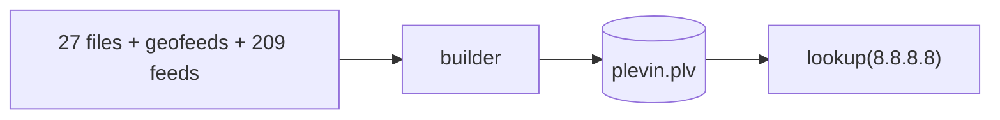
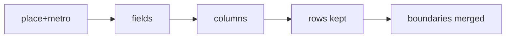
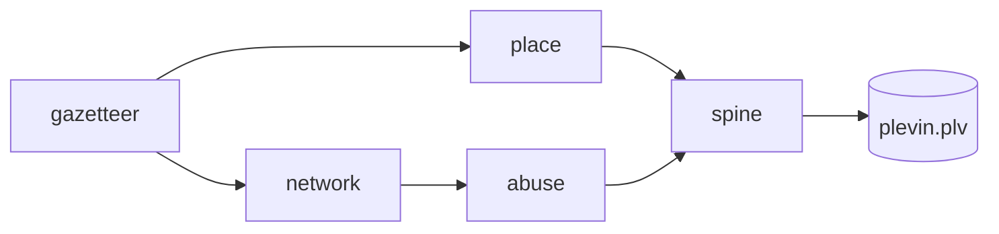
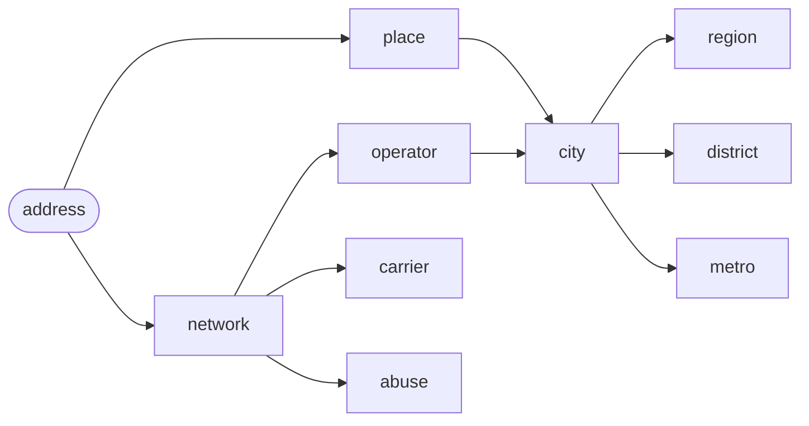
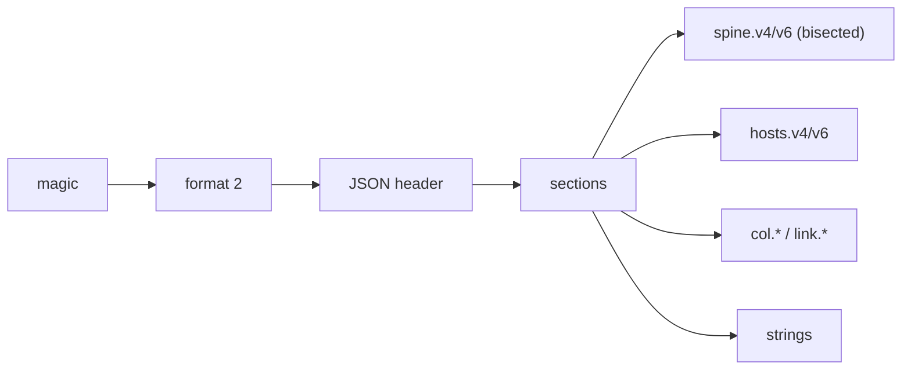

<div align="center">

# plevin builder

**27 source files, operator geofeeds and 209 feeds in one offline `.plv` database.**


[everything](https://github.com/tn3w/plevin/releases/latest/download/plevin.plv) 18.7 MB ·
[location](https://github.com/tn3w/plevin/releases/latest/download/plevin.metro-place.plv) 6.3 MB ·
[network](https://github.com/tn3w/plevin/releases/latest/download/plevin.network.plv) 7.4 MB ·
[abuse](https://github.com/tn3w/plevin/releases/latest/download/plevin.abuse-level-abuse-provider-abuse-service.plv) 4.1 MB ·
[country](https://github.com/tn3w/plevin/releases/latest/download/plevin.place-country-code.plv) 378 KB ·
[blocklist](https://github.com/tn3w/plevin/releases/latest/download/blocklist.netset) 8.2 MB

</div>


```mermaid
flowchart LR
    S["27 files + geofeeds + 209 feeds"] --> B[builder] --> D[("plevin.plv")] --> Q["lookup(8.8.8.8)"]
```

## Build

```bash
cargo build --release

./target/release/plevin-builder                    # dist/plevin.plv, every field
./target/release/plevin-builder place+metro        # dist/plevin.metro-place.plv
./target/release/plevin-builder network            # dist/plevin.network.plv
./target/release/plevin-builder blocklist.netset   # dist/blocklist.netset
./target/release/plevin-builder raw                # dist/plevin.raw, only the raw file
```

About a minute from fetched inputs. [`build.yml`](../.github/workflows/build.yml)
fetches, builds and releases daily, with secrets `IP2LOCATION_TOKEN` and
`PEERINGDB_API_KEY`. The build log names **silent feeds**: listed feeds that matched
nothing, a dead URL or a changed format. The fetch log lists every feed's size
(`size` lines) to spot a feed that came back thin.

| path                  | holds                          |
| --------------------- | ------------------------------ |
| `src/`                | the builder, ten files         |
| `data/feeds.json`     | feeds, one entry each          |
| `data/operators.json` | brands, satellite ASNs, category and text rules |
| `data/regions.json`   | region code fixes              |
| `data/metros.json`    | US market labels               |
| `inputs/`             | fetched sources (ignored)      |
| `dist/`               | output (ignored)               |

## Selections

`term+term` builds only what the terms need; no argument builds everything.


```mermaid
flowchart LR
    T["place+metro"] --> F[fields] --> C[columns] --> R[rows kept] --> B[boundaries merged]
```

- **Rebuilt, not sliced:** a dropped field takes its column, strings and boundaries
  with it.
- **Answers never change** with the selection. The union of two selections is
  byte-identical to building both.
- **Derived booleans** keep only the values they ask about; `abuse.is_tor_exit_node`
  alone builds to tens of kilobytes.
- **`abuse.level`** builds small: one boundary per step, nothing below 0.40.
- **`abuse.risk`** brings `abuse.level` with it: the level is cut from the risk, so
  the file answers both for about a kilobyte.
- **`network.operator.brand`** alone stores the brand itself, not the handle and
  company it is derived from.
- **`abuse.provider`** links a network only where a service record reaches it.
- **`abuse.is_hosting_provider`, `network.carrier.is_mobile` and `user_type`** bring
  `network.operator` with them, for the category a range falls back to.
- **Naming:** the selection is written into the file and the filename.

## Raw file

`raw` writes `plevin.raw` (30 MB): the world before any selection cuts it. It exists so
a selection can be cut later, anywhere, exactly as the builder would cut it. The
[JS splitter](../js/README.md#slim-databases) reads only this file.

- **Tables:** every `col.*` and `link.*` section for every row, uncollapsed and
  unranked; text columns hold ids into one sorted `strings` pool.
- **Spines:** `spine.v4` and `spine.v6` (with place points) and `blocks.v4` and
  `blocks.v6` (place snapped to blocks), each with every carried column and `whole`.
  Both are stored because snapping is not recoverable from the other.
- **Hosts:** `hosts.v4` and `hosts.v6` keep every reported address with its abuse row.
- **Header:** format byte `3`, selection `raw`, the `full` field list and vocabularies.
- **Reproducible:** cutting `plevin.raw` to any selection gives the file the builder
  writes for it, byte for byte: the splitter's encoder reproduces liblzma's output
  and its delta-or-plain and tuning choices.

## Blocklist

`blocklist.netset`: addresses feeds reported at 40 or above, plus addresses a current
list names as an anonymising service (`published` or `measured` evidence only). It
reads what was said about the address itself, not what its service is worth or what
its ASN scores. Published CDN and crawler ranges never make it: reports there are
shared-edge noise. Ranges are merged into the fewest aligned CIDRs, reserved space cut.

## Sources


Fetched flat into `inputs/`; gzip inflated, zip reduced to its largest member.

| file                                                  | from                                                        | license          |
| ----------------------------------------------------- | ----------------------------------------------------------- | ---------------- |
| `GeoLite2-City.mmdb`                                  | `github.com/P3TERX/GeoLite.mmdb`, latest release            | GeoLite2 EULA    |
| `IP2LOCATION-LITE-DB11.IPV6.BIN`                      | `ip2location.com/download?token=…&file=DB11LITEBINIPV6`     | CC BY-SA 4.0     |
| `dbip-city-lite.mmdb`                                 | `download.db-ip.com/free/`, this or last month              | CC BY 4.0        |
| `cities500.txt`, `allCountries.txt`                   | `download.geonames.org/export/dump/`, `/export/zip/`        | CC BY 4.0        |
| `admin1CodesASCII.txt`, `admin2Codes.txt`             | `download.geonames.org/export/dump/`                        | CC BY 4.0        |
| `ne_10m_admin_0_countries.*`, `ne_10m_admin_1_…dbf`   | `naciscdn.org/naturalearth/10m/cultural/`                   | public domain    |
| `iso_3166-2.json`                                     | `salsa.debian.org/iso-codes-team/iso-codes`                 | LGPL 2.1+        |
| `bview`                                               | `data.ris.ripe.net/rrc00/latest-bview.gz`, 4 GB             | RIPE NCC terms   |
| `vrps.csv`                                            | `console.rpki-client.org/vrps.csv`                          | public RPKI data |
| `nro-delegated-stats`                                 | `ftp.ripe.net/pub/stats/ripencc/nro-stats/latest/`          | open RIR stats   |
| `asn.txt`                                             | `ftp.ripe.net/ripe/asnames/`                                | RIPE NCC terms   |
| `asrank`                                              | `api.asrank.caida.org/v2/restful/asns/`, paged, as `asn`, cone, exchange | CAIDA AUP        |
| `as-org2info.txt`, `as-rel2.txt`                      | `publicdata.caida.org/datasets/`, newest                    | CAIDA AUP        |
| `peeringdb_net.json`, `_org.json`, `_netixlan.json`   | `peeringdb.com/api/`, with API key                          | CC BY 4.0        |
| `abuse-contacts.tsv`                                  | `github.com/tn3w/asn-abuse`, latest release                 | source repository |
| `ripe_inetnum`, `ripe_inet6num`, `ripe_organisation`  | `ftp.ripe.net/ripe/dbase/split/`                            | RIPE NCC terms   |
| `apnic_inetnum`, `apnic_inet6num`, `apnic_organisation` | `ftp.apnic.net/apnic/whois/`                              | APNIC terms      |
| `afrinic_db`                                          | `ftp.afrinic.net/dbase/afrinic.db.gz`                       | AFRINIC terms    |
| `lacnic_db`                                           | `ftp.lacnic.net/lacnic/dbase/lacnic.db.gz`, Latin-1         | LACNIC terms     |
| `geofeeds`                                            | every RFC 8805 feed the dumps above reference, plus LACNIC's | per operator     |
| feeds                                                 | [`data/feeds.json`](data/feeds.json)                        | per publisher    |

- **Registry dumps** are cut to the keys the builder reads while fetching (`grep -a`:
  dumps hold invalid UTF-8), plus `geofeed:` and geofeed `remarks:`, and read line by
  line.
- **Geofeeds** are fetched concurrently into one file, each row prefixed with its URL.
- **Hostname feeds** (`hosts` key) are resolved to addresses while fetching.
- **ARIN and LACNIC** publish no holder data, so their unannounced space has a registry
  and a block but no name.

### Feed coverage

| kind                          | feeds | examples                                               |
| ----------------------------- | ----: | ------------------------------------------------------ |
| abuse reports                 |    67 | AbuseIPDB, abuse.ch, blocklist.de, DShield, Project Honey Pot |
| VPN servers                   |    37 | provider APIs, [gluetun-servers](https://github.com/qdm12/gluetun-servers), resolved hostnames |
| public proxies                |    14 | scraped proxy lists, IP2Proxy                          |
| Tor, relays                   |     4 | Onionoo exits, iCloud Private Relay, Cloudflare WARP   |
| cloud, hosting                |    21 | AWS, GCP, Azure, Oracle, IBM, geofeeds of hosters      |
| crawlers                      |    17 | Google, Bing, Apple, OpenAI, Perplexity, CCBot, Kagi   |
| CDN, content, SaaS            |    19 | Cloudflare, Fastly, Gcore, Imperva, Atlassian, Stripe  |
| exchanges                     |     1 | PeeringDB IXP peering LANs                             |
| ASN tags, DROP                |    18 | bgp.tools, Spamhaus DROP and ASN-DROP, risk-db         |
| satellite, SASE               |     2 | Starlink geofeed, Zscaler                              |
| dedicated parsers, flags      |     9 | IP2Proxy PX11, IPsum, APNIC users, MCC-MNC, anycast    |

### Feed keys

Each entry in [`data/feeds.json`](data/feeds.json) is a URL plus what its matches mean.

| key            | meaning                                                              |
| -------------- | -------------------------------------------------------------------- |
| `regex`        | first group is an address, CIDR or (with `scope: "asn"`) an ASN      |
| `format`       | a dedicated parser instead: `ipsum`, `px11`, `asns`, `aspop`, …      |
| `hosts`        | resolve these hostnames while fetching, then match `regex`           |
| `provider`     | named operator of the service or range                               |
| `user`         | category the range is used as                                        |
| `service`, `evidence` | anonymising service and how it is known                       |
| `threat`       | what reporting feeds saw the address do                              |
| `risk`, `group`, `window` | reported risk, shared upstream, days a listing covers     |
| `network_risk` | ASN-wide risk for `scope: "asn"` or prefix feeds                     |
| `flags`        | `is_anycast`, `is_satellite`, `is_mobile`                            |
| `weak`         | `user` yields to any other claim                                     |
| `aged`         | halve service worth: never drops addresses or stopped updating       |
| `trusted`      | operator-published range: damp reports, ignore scraped services      |
| `suffix`       | widen each match to this prefix length                               |
| `geofeed`      | the input is RFC 8805: its rows place the ranges they name           |

## Pipeline


```mermaid
flowchart LR
    G[gazetteer] --> P[place] --> S[spine]
    G --> N[network] --> A[abuse] --> S
    S --> F[(plevin.plv)]
```

| stage     | does                                                                          |
| --------- | ----------------------------------------------------------------------------- |
| gazetteer | cities, regions, districts, postal codes from GeoNames; country of a coordinate from Natural Earth; region ISO codes from `data/regions.json`, then `iso_3166-2.json`, never one ISO does not list; an empty name matches no place |
| place     | operator geofeeds first, then MaxMind, IP2Location where MaxMind has only a country; IP2Location instead when it and DB-IP agree on another city within 25 km; DB-IP agreeing lifts confidence to 90; points interned at 1e-4°; nearest city in the same country within 500 km, else within 3000 km; accuracy is the largest of source radius, snap distance and a per-granularity floor |
| network   | origin ASN by majority of RIS peers, routes wider than /8 or /16 dropped as leaks; ROAs → `rpki`, `roas`; NRO → registry, country and year of the ASN and of every block; CAIDA → company, tier, handle, registry where `asn.txt` and NRO have none, and the customer cone from AS Rank; street addresses never become a company; PeeringDB → website, category, peering, address, and its other names for matching carriers; LACNIC `aut-num` → city where PeeringDB has none; IP2Proxy's most common range domain → website where PeeringDB has none; text tidied (below); category decided (below); carriers matched by name (below) |
| abuse     | one record per span plus an ASN baseline, from feeds declared in `data/feeds.json` |
| spine     | one boundary set carrying place, network and abuse; reserved space carries none; ids ranked by use |

### Category

The kind of network, one of the `categories` vocabulary, from the first of these that
speaks:

1. **A list.** PeeringDB's type, bgp.tools' class, then its tag lists. A tag naming
   `government`, `education` or `military` beats a looser kind (residential, business,
   content, transit, infrastructure, non-profit), `cellular` beats the same except
   transit and content, `hosting` and `cdn` beat `content` only. Rules live in
   `data/operators.json`.
2. **The domain.** `.mil`, `.gov`, `.edu` and their second-level forms (`go.jp`,
   `ac.uk`) from the website, else the abuse mailbox.
3. **The name.** Whole words such as *university*, *ministerio*, *police*.
4. **The users.** Over 1,000 APNIC users on an edge network read `residential`.

Rules 2 to 4 only fill a network no list classified. Held against the networks a list
did classify, they agree at 96% (education by domain), 86% (government by domain), 97%
and 94% (education and government by name) and 83% (users); business, cellular and
hosting by name agreed at 56%, 38% and 54% and are not used. The address-level
type (`carrier.user_type`) is the range's own feed where one names it, else the
operator's category: nothing stores the category twice.

### Carriers

A network is matched to mobile network codes by whole-word name against the MCC-MNC
lists in the same country, over its handle, company and PeeringDB names. It needs
APNIC users and a residential or cellular category; a cellular one needs neither. The
most common `mcc` of the matches wins, `mnc` stays empty where the matches disagree.
A cellular network no name matches takes the country's `mcc` where the lists give the
country just one.

### Text

Every operator text is tidied before it is counted: UTF-8 first, Latin-1 where a line is
not valid UTF-8 (RIPE and APNIC dumps mix both), double-encoded accents mended, no-break
and zero-width marks dropped, whitespace collapsed, trailing separators trimmed.
Placeholders (`N/A`, `Private Customer`, `example.com`), pasted certificates, strings
that are mostly `?` and postal codes of zeros are dropped. A website is kept as host and
path, without scheme and `www.`, and never an address or an `example.com`. A mailbox
needs a name and a dotted domain. Years before 1980 and elevations below −500 m are
missing values.

### Geofeeds

- **Found** through `geofeed:` and `remarks: Geofeed …` on RIPE, APNIC and AFRINIC
  objects, plus LACNIC's consolidated feed and feeds marked `geofeed` (Cloudflare
  WARP, iCloud Private Relay, Starlink, hosters).
- **Vouched:** a row counts only inside the referencing object, or inside any object of
  the same `org`. Rows claiming someone else's space are dropped. Feeds marked
  `geofeed` are vouched by the operator publishing them.
- **Placed** at a GeoNames city: name within the row's ISO region first, then the
  country; alternate names count, so `Muenchen` and `Göteborg` match.
- **Nested** feeds: the narrowest row wins.
- **Exact:** rows narrower than /24 or /40 keep their own boundaries in builds with
  coordinates; every other source, and builds without coordinates, snap to /24 and
  /40. WARP and relay /32s land on their own city.
- Against the rows themselves, city agreement rises from 59% to 80% on v4 and from 44%
  to 78% on v6.

### Location votes

DB-IP City Lite is a third opinion, never a leading source. Against held-out geofeed
rows:

| DB-IP use                                  | city agreement | place build |
| ------------------------------------------ | -------------: | ----------: |
| none                                       |          61.0% |     5.06 MB |
| confidence only                            |          61.0% |     5.07 MB |
| outvote MaxMind, any distance              |          64.7% |     5.97 MB |
| outvote MaxMind within 25 km (**used**)    |          64.0% |     5.38 MB |
| outvote MaxMind beyond 100 km              |          61.3% |     5.50 MB |

Far disagreements are rare and cost boundaries; near ones are suburb-versus-city calls
two sources settle cheaply. Geofeed rows are never outvoted.

### Abuse scoring

- **Record:** strongest claim wins: best evidence, then most specific service, `weak`
  claims last. The narrowest range names the user type: a crawler inside AWS reads
  `search_engine_spider`, not `hosting`.
- **Risk:** max within a feed `group`, noisy-OR across groups.
- **Service floor:** risk never drops below what the service itself is worth:

  | service           | worth |
  | ----------------- | ----- |
  | Tor exit          | 0.85  |
  | public proxy      | 0.75  |
  | residential proxy | 0.70  |
  | VPN               | 0.50  |
  | private relay     | 0.15  |

  Times 0.85 when reported, 0.6 when inferred, halved again for `aged` feeds: lists that
  never drop an address or stopped updating.
- **Trusted ranges:** operator-published CDN and crawler ranges keep a quarter of their
  reported risk and ignore `reported` or `inferred` service claims. Scraped proxy lists
  and URL feeds name shared edges, not culprits.
- **Threat:** the category of the strongest reporting claim; IP2Proxy's own threat
  column counts at the lowest weight.
- **ASN baseline:** its own feeds, noisy-OR the square root of the risk-weighted share
  of its announced space that was reported. v4 is counted in addresses, v6 in /64s,
  and the worse family stands. Under 0.01 the ASN reads as unseen. This is
  `network_risk`.
- **Baseline reach:** what the whole ASN is (a service, `is_anycast`, `is_satellite`)
  reaches every address in it, merged under the address's own claims. Its risk does not:
  `risk`, `level`, `threat` and `last_seen_days` come from the address alone, in every
  build.
- **`last_seen_days`:** the tightest feed window that hit, only where a risk is set.

## Fields


```mermaid
flowchart LR
    A([address]) --> P[place] --> C[city] --> R[region]
    C --> D[district]
    C --> M[metro]
    A --> N[network] --> O[operator] --> C
    N --> K[carrier]
    N --> B[abuse]
```

| group     | stored                                                                        |
| --------- | ----------------------------------------------------------------------------- |
| `place`   | point: lat, lon, accuracy, granularity, confidence; city: name, ascii (only where it differs), id, population, type, postal, postal_partial, timezone, elevation; region: name, code, iso, type, id; district: name, code, id |
| `metro`   | code, label                                                                   |
| `network` | asn, handle, prefix, rir, country, since, rpki, roas; operator: company, website (host and path), category, tier, peering, cone, scope, rir, since, street, city, state, postal, abuse_email, country; carrier: user_count, mcc, mnc |
| `abuse`   | name, user_type, service, evidence, threat, is_anycast, is_satellite, risk, level, last_seen_days; per ASN: risk (`network_risk`), service and flags (the baseline) |

Derived by the readers: every `is_*` flag except `is_anycast` and `is_satellite`,
`operator.brand` (from handle and company), `operator.domain` (registered domain of the
website, else of the mailbox where it is the operator's own), `carrier.user_type` (the
range's `abuse.user_type`, else `operator.category`), `place.country.continent`,
`european_union`, `driving_side`, `languages`, currency and calling code (from the
country), `place.time` (from the timezone) and `network.cidr`, `start`, `end` (from the
prefix).

`operator.city` answers its GeoNames id and name only, in every build: the rest of the
city is the place table's, not a company's.

| scale                   | unit                          |
| ----------------------- | ----------------------------- |
| `risk`, `network_risk`  | integer percent, 255 unseen   |
| `level`                 | 1–3, 0 unset                  |
| `lat`, `lon`            | degrees × 10,000, signed      |
| `accuracy`              | km                            |
| `confidence`            | 0–100                         |
| `elevation`             | metres, signed                |
| `mcc`, `mnc`            | ITU codes, 0 unknown          |
| `prefix`                | prefix length, 0 unannounced  |
| `postal_partial`        | prefix length of `postal`     |
| `since`                 | year, 0 unknown               |

Link 0 means absent; a value is empty as `""`, the empty vocabulary member or the
sentinel above.

| vocabulary  | members                                                                       |
| ----------- | ----------------------------------------------------------------------------- |
| evidence    | published, measured, reported, inferred                                       |
| threat      | botnet, malware, phishing, bruteforce, web_attack, spam, scanner              |
| service     | tor_exit_node, private_relay, anonymous_vpn, residential_proxy, public_proxy  |
| category    | residential, business, hosting, education, government, military, cdn, content, infrastructure, cellular, search_engine_spider, traveler, transit, exchange, non-profit |
| granularity | city, region, country                                                         |
| rpki        | unknown (announced, no ROA), valid, invalid; empty unannounced               |
| countries   | every code GeoNames or NRO names, for `network.country`                       |

## File format


```mermaid
flowchart LR
    M[magic] --> V[format 2] --> H[JSON header] --> S[sections]
    S --> A["spine.v4/v6 (bisected)"]
    S --> O["hosts.v4/v6"]
    S --> C["col.* / link.*"]
    S --> T[strings]
```

- **Header:** `PLEVIN\0`, format byte `2`, length, then JSON with fields, vocabularies,
  and the section table. Each section has offset, count, encoding, block and group
  size, and LZMA tuning.
- **Section body:** block count, key width, block offsets, first key per block, blocks.
- **Blocks:** each decodes alone. A block is what the codec packs; a group is what a
  lookup decodes.
- **Columns:** a width byte per block, then fixed-width values (`fixed` or `signed`).
  Rising columns are stored as `delta` steps where that packs smaller.
- **Strings:** one sorted pool, front-coded, restarting every 64.
- **Addresses:** varint gaps, network half only for v6.
- **Block sizes:** 16,384 values, 32,768 addresses (groups of 128), 4,096 strings.

### Codec

Every block is raw LZMA1 (preset 9, 1 MiB window, end marker, no `.lzma` header). Each
section picks its tuning `[lc, lp, pb]` by packing a sample five ways: `[3, 0, 0]` for
text and varints, `[0, 2, 2]` for 4-byte columns. The position-aware tuning is what
zstd cannot do:

| build   | zstd    | LZMA    |      |
| ------- | ------- | ------- | ---- |
| full    | 18.3 MB | 16.4 MB | −10% |
| place   | 6.0 MB  | 5.1 MB  | −15% |
| network | 7.6 MB  | 7.0 MB  | −8%  |
| abuse   | 4.1 MB  | 3.8 MB  | −7%  |
| country | 400 KB  | 376 KB  | −6%  |

LZMA decodes slower than zstd, so readers decode a block only as far as a lookup
reaches and resume later. Warm lookups match zstd; cold ones take about twice as long.

## License

Apache 2.0, see [LICENSE](../LICENSE). Output carries the licenses of the sources above.
